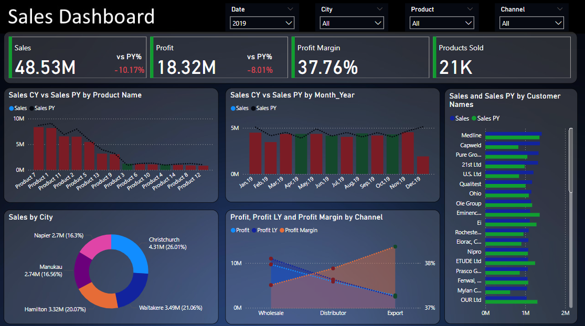

## 📝 Data

- **`Sales Analysis Report.xlsx`**  
  Contains the raw transactions with columns:
  - **Date** (YYYY-MM) & **Month_Year**  
  - **City**, **Channel**, **Product**, **CustomerName**  
  - **Sales** (Current Year) & **Sales PY** (Prior Year)  
  - **Profit** (Current Year) & **Profit LY**  
  - **Profit Margin**  
  - **Products Sold**  

All key measures (e.g. PY comparisons, profit margin) are calculated in Power Query / DAX.

---

## 🚀 Getting started

1. **Clone** or **download** this repo.  
2. Open **`My_Sales_Dashboard.pbix`** in Power BI Desktop.  
3. Refresh the data source to pull in the Excel file.  
4. Use the slicers at the top to filter by **Date**, **City**, **Product**, and **Channel**.

---

## 📊 Dashboard overview

1. **KPI cards**  
   - **Sales**: 48.53 M (vs PY **–10.17%**)  
   - **Profit**: 18.32 M (vs PY **–8.01%**)  
   - **Profit Margin**: 37.76%  
   - **Products Sold**: 21 K  

2. **Sales vs PY**  
   - By **Product** (bar + dotted PY line)  
   - By **Month** (clustered columns + dotted PY line)  
   - By **Customer** (horizontal bars)

3. **Sales by City**  
   - Donut chart showing share by city (e.g. Christchurch 26%)  

4. **Profit & Margin by Channel**  
   - Combined area / line showing Profit CY, Profit LY, and Profit Margin

---

## 🔍 Key insights

- **Year-over-Year decline**: Sales down ~10%, Profit down ~8% vs 2018.  
- **Top city**: Christchurch leads with ₹4.31 M (26% share).  
- **Channel performance**:  
  - **Wholesale**: strong CY profit vs LY  
  - **Distributor & Export**: diverging margin trends  
- **Customer leaders**: “OUR Ltd” at ~₹2 M; top 5 customers drive >40% of sales.  
- **Product winners**: Product_1 and Product_2 contribute ~30% of total sales.

---

## 📞 Contact

**Chirag Pandey**  
– Email: chiragpandey0504@gmail.com  
– GitHub: [@chiragpandey0504](https://github.com/chiragpandey0504)  
